# Лабораторная 1

## Keycloak в Docker

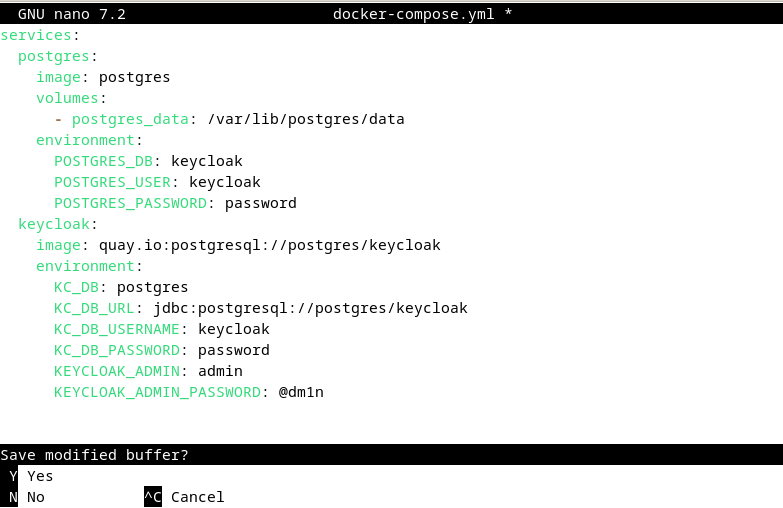
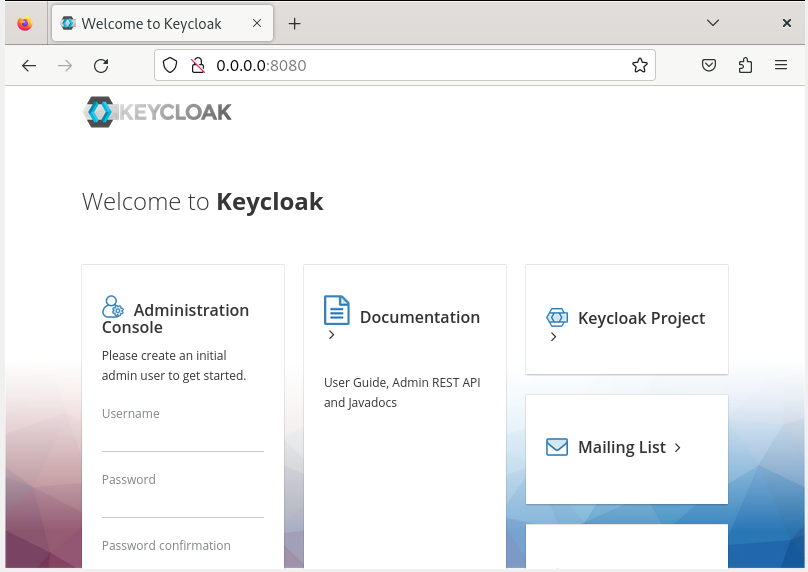

## Создаём realm в keycloak

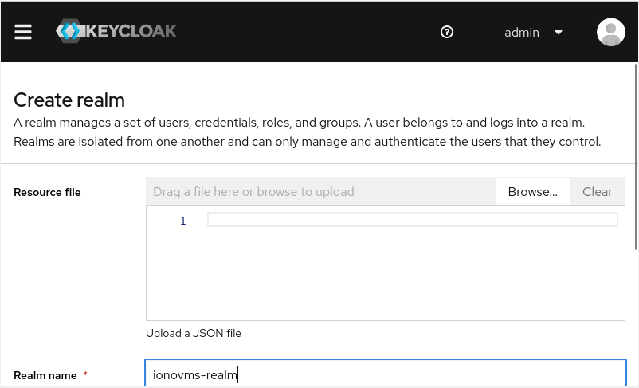

## Создание пользователей `admin` и `user`

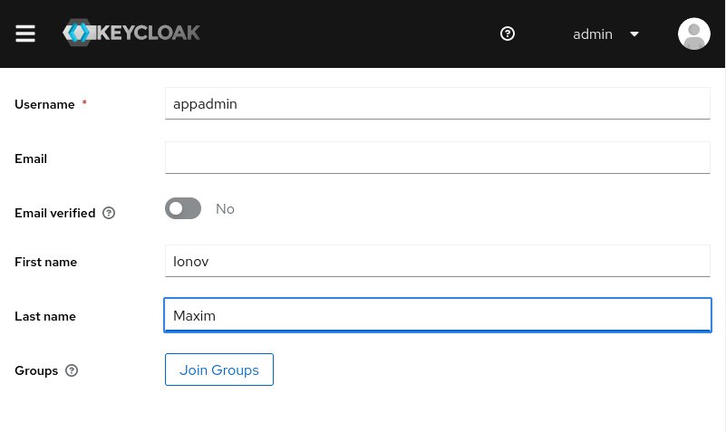
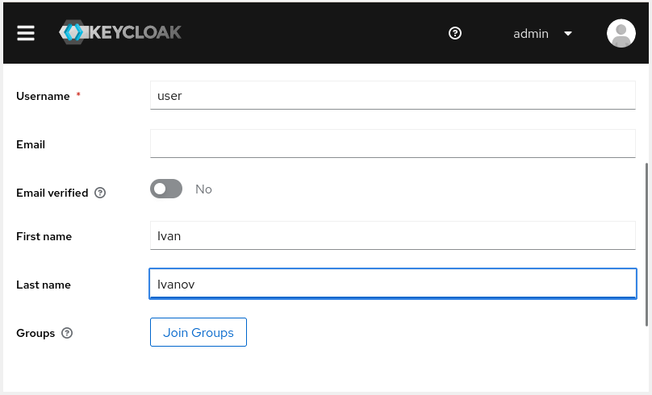
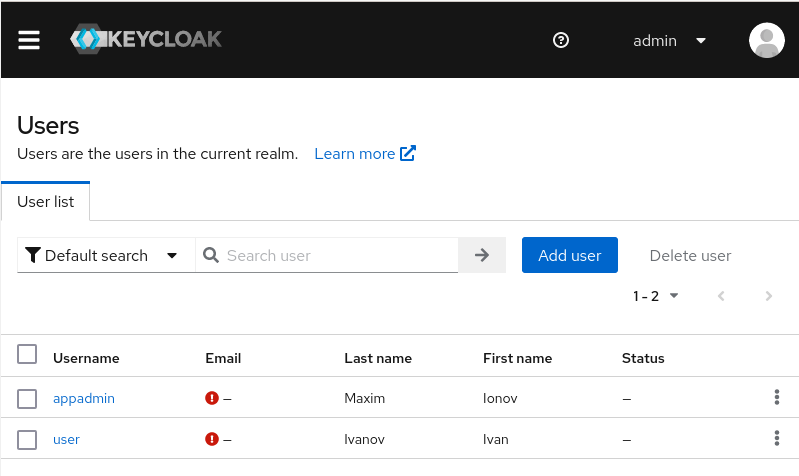

## Разворачиваем NextCloud через Docker и после этого делаем клиент в Keycloak

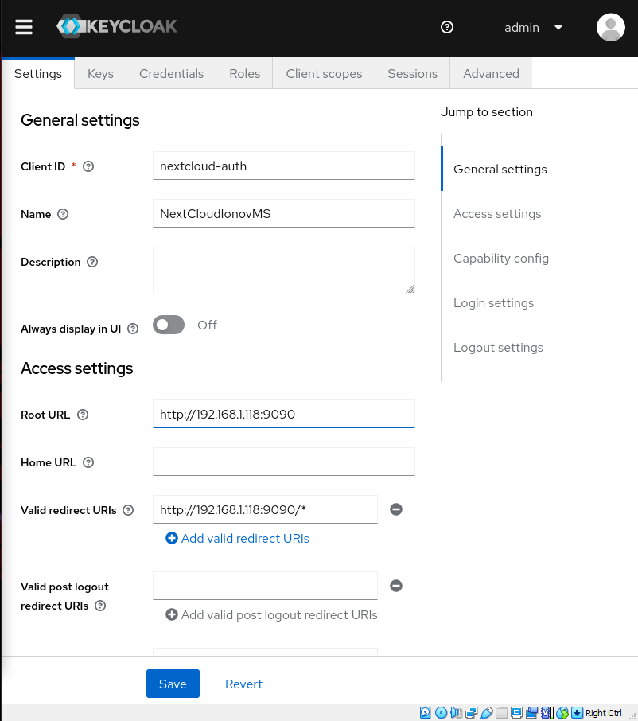

## Настраиваем NextCloud для получения возможности работы с Keycloak

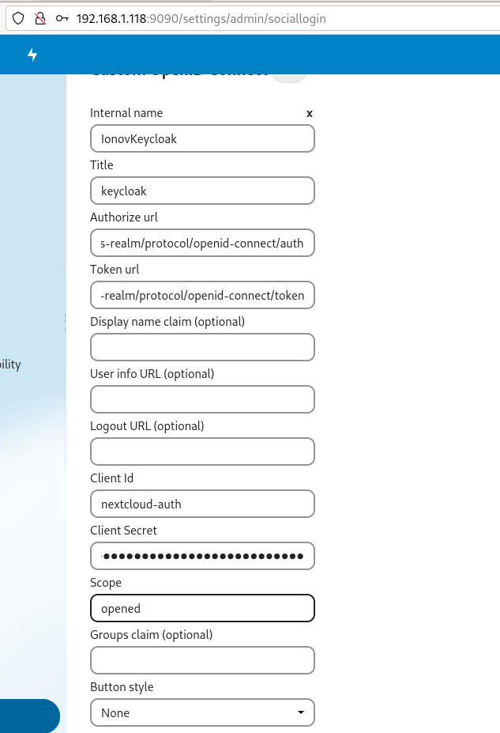

## Проверка правильности настроек и возможности аутентификации

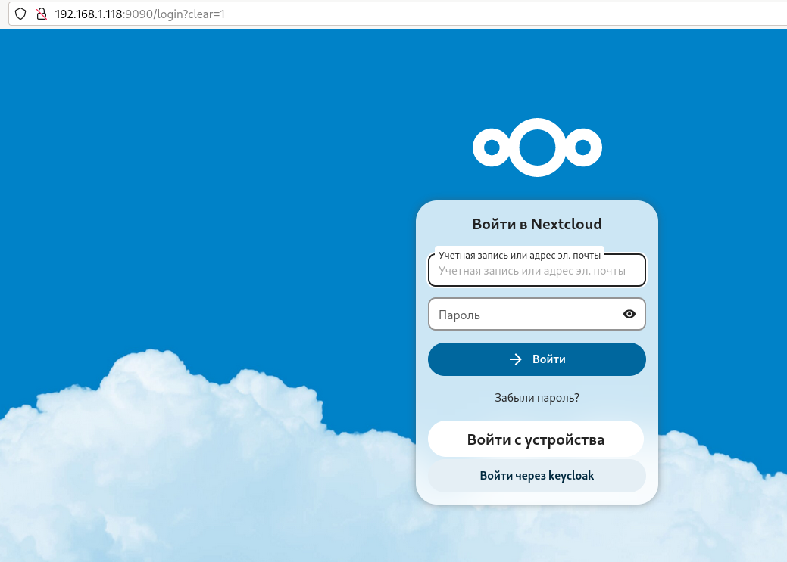
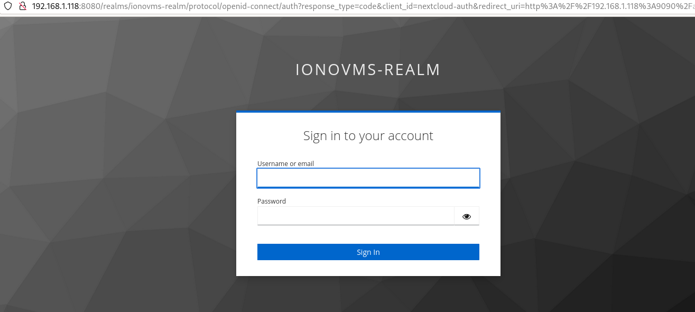

## Настроим дополнительно двухфакторную аутентификацию в настройках Keycloak и проверим сработало ли всё уже на авторизации NextCloud

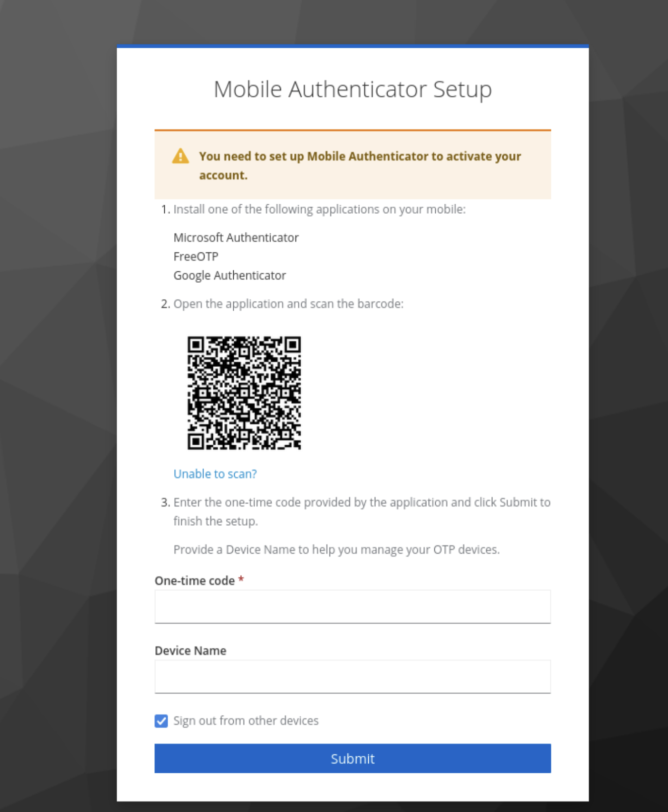
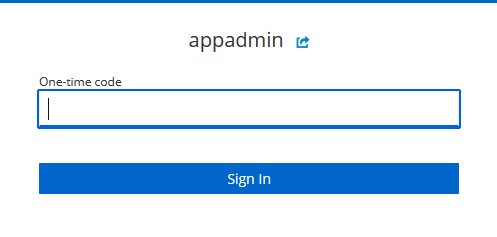
