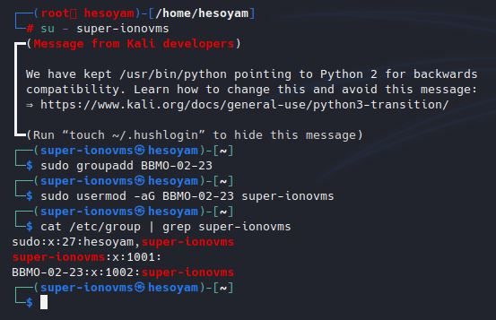

# Практическое задание №2

## Создание суперпользователя

## Создание группы `BBMO-02-23` и добавление суперпользователя в нее

## Создание пользователя с добавлением в ранее созданную группу `BBMO-02-23`

## Наделение пользователя полномочиями по созданию и удалению файлов в домашнем каталоге суперпользователя

## Проверка работы новых полномочий у пользователя

