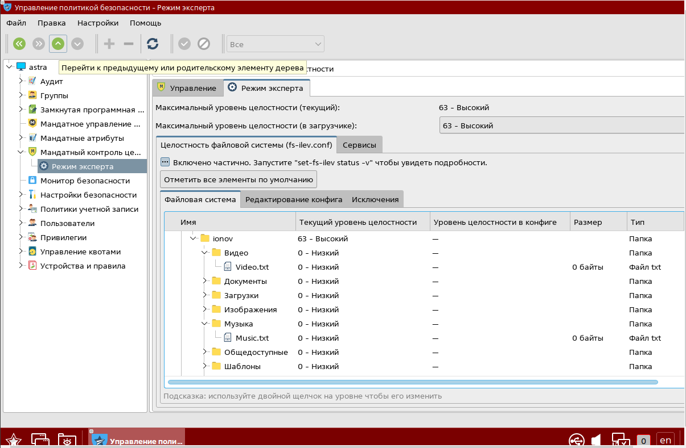
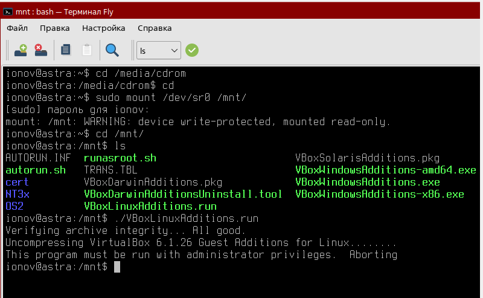

# Практика 4 (PR 4)

# Практическое задание на тему "Контроль целостности"

# Установка и запуск ВМ c Astra Linux

 Установлена версия системы "Смоленск" с максимальным уровнем защиты:

# Установка, настройка и проверка мандатного контроля целостности (МКЦ)

 Запускаем утилиту "Управление политикой безопасности":

 В меню "Режим эксперта" назначаем уровни целостности для директорий. В качестве проверки правила NWU обозначили 2 тестовые директории ("Музыка" и "Видео") с правами:

Проверяем настройку мандатного контроля зайдя в учетную запись с атрибутом целостности на уровне "Низкий"

 Здесь можно увидеть, что копирование файла с атрибутом ниже в папку с атрибутом выше не сработало - была получена ошибка доступа. В то же время "запись вниз" работает.

 # Работа с режимом замкнутой программной среды (ЗПС)

Проверка работы режима ЗПС в утилите "Управлении политикой безопасности":

В качестве теста пробуем запустить скрипт госевых дополнений:

 # Утилиты контроля целостности и регламентного контроля целостности: gostsum, afick

 Gostsum - это утилита, которая вычисляет хэш-сумму файлов в соответствии с ГОСТ Р 34.11-2012.

   

 Видим, что после изменения значения хэшей разные
 
 Afick - это утилита, которая следит за целостностью файловой системы ОС.

 Выполним команду - видим, что команда показала нам изменения в файловой системе ОС.

 
