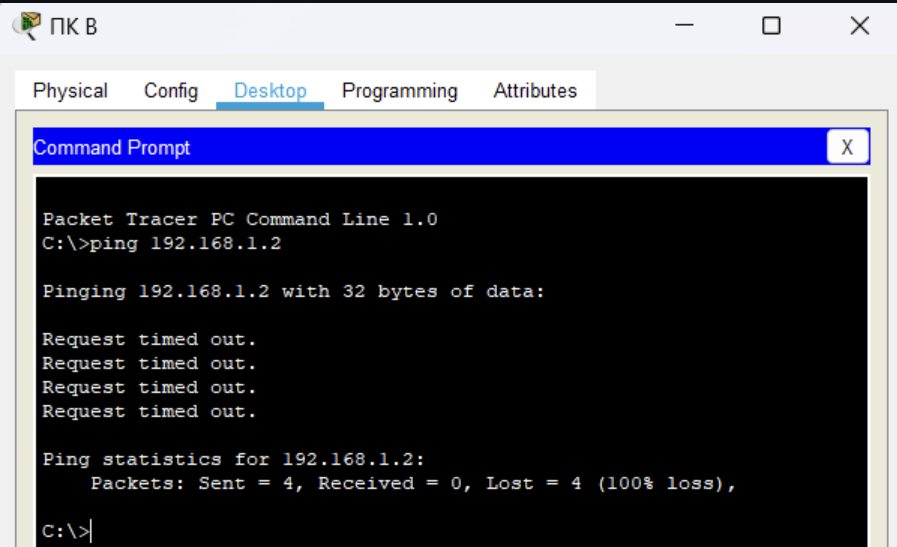
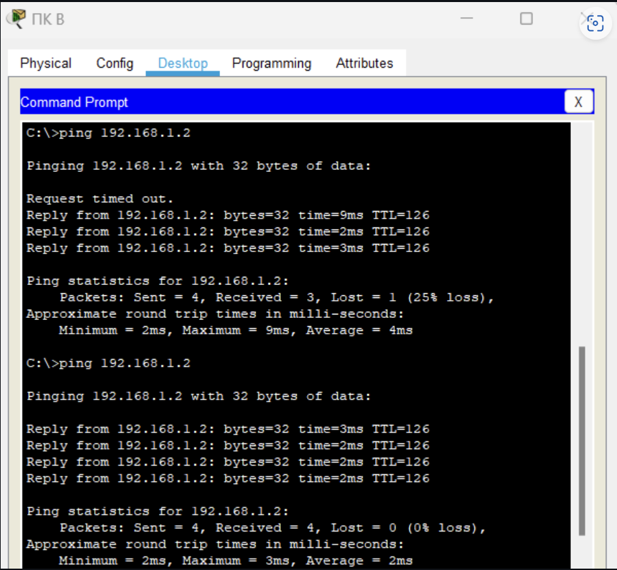

# Практическое задание №6. Настройка протокола GRE

## Определение IP-адреса порта S0/0/0 на маршрутизаторе RA:

## Отправка эхо-запроса с RB на RA:

## Определение IP-адреса на ПК А:

## Отправка эхо-запроса с ПК B на ПК А до настройки туннеля GRE:

## Настройка туннеля GRE на маршрутизаторе RA:

## Настройка туннеля GRE на маршрутизаторе RB:

## Настройка маршрута для частного трафика IP на маршрутизаторе RA:

## Настройка маршрута для частного трафика IP на маршрутизаторе RB:

## Отправка эхо-запроса с ПК B на ПК А после настройки GRE туннеля:

## Трассировка от ПК А до ПК В:

## Проверка успешности выполнения работы:

